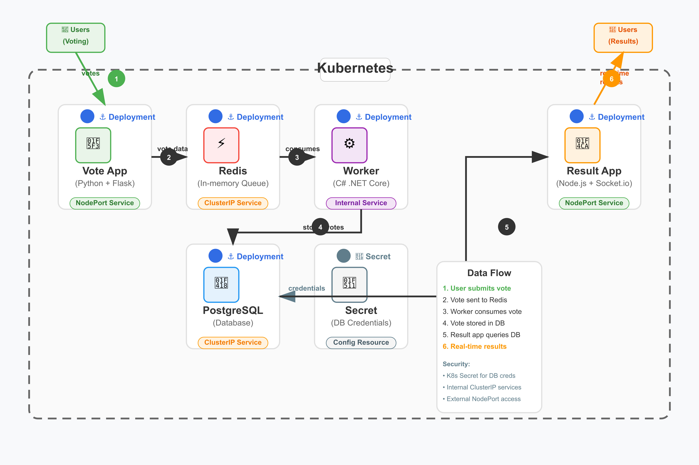

# Kubernetes Voting App

This project contains the Kubernetes deployment for the [Docker Sample Voting App](https://github.com/dockersamples/example-voting-app). It's a simple microservices-based application used to demonstrate container orchestration with Kubernetes.

## 🧩 Application Architecture

The app consists of 5 components:

- `vote` – Frontend written in Python (Flask)
- `result` – Backend results UI in Node.js
- `worker` – Background processor written in .NET
- `redis` – In-memory data store used as a queue
- `db` – PostgreSQL database for storing vote results

## 📸 Diagram 


## 📦 Directory Structure

```bash
.
│   ├── vote-deployment.yaml
│   ├── result-deployment.yaml
│   ├── worker-deployment.yaml
│   ├── redis-deployment.yaml
│   ├── postgres-deployment.yaml
│   ├── vote-service.yaml
│   ├── result-service.yaml
│   ├── redis-service.yaml
│   ├── postgres-service.yaml
│   └── 
├── README.md
```

## 🚀 Getting Started

### Prerequisites

- Kubernetes cluster (e.g. Minikube, kind, EKS, etc.)
- `kubectl` CLI installed and configured
- (Optional) Ingress controller if using Ingress

### Deploy the App

1. Clone this repository:
   ```bash
   git clone https://github.com/your-username/k8s-voting-app.git
   cd k8s-voting-app
   ```

2. Apply all Kubernetes manifests:
   ```bash
   kubectl apply -f k8s/
   ```

3. Access the application:
   - If using `NodePort`:  
     Visit the exposed port on your cluster IP or `localhost` (Minikube users can run `minikube service vote`).
   - If using Ingress:  
     Ensure DNS and ingress controller are configured.


## 📚 Resources

- [Docker Voting App (original repo)](https://github.com/dockersamples/example-voting-app)
- [Kubernetes Documentation](https://kubernetes.io/docs/home/)

## 📝 License

MIT License
